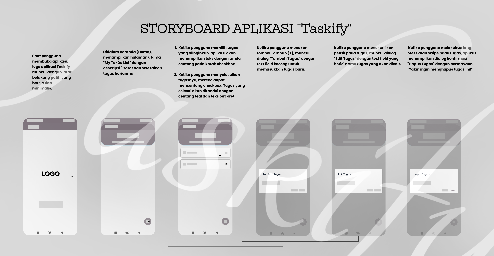
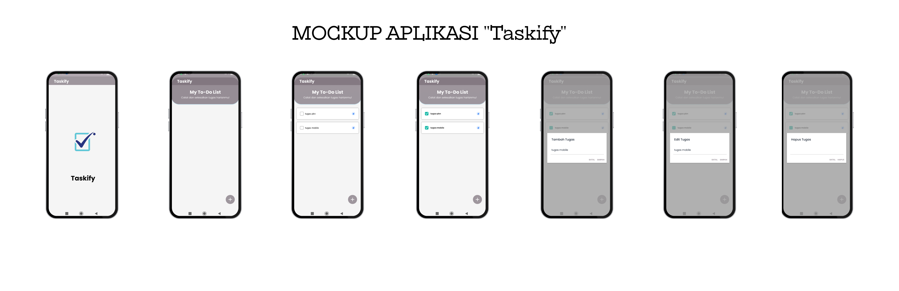
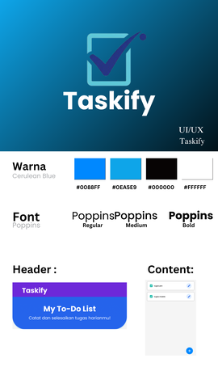
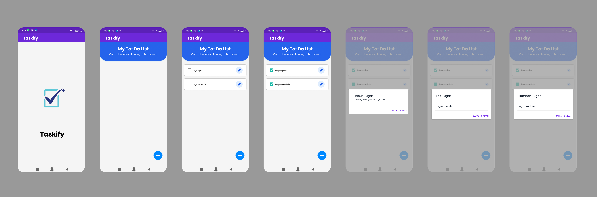
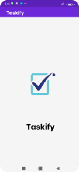
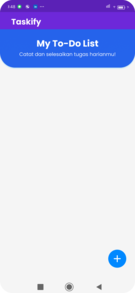
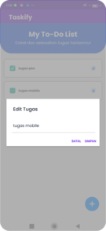
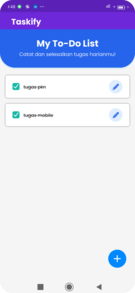
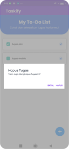

| Variable           |             Isi            |
| -------------------|----------------------------|
| *Nama*             |  Patur Rahman Hakim        |
| *NIM*              |  312410271                 |
| *Kelas*            |  TI.24.A2                  |
| *Mata Kuliah*      |  Pemrograman Mobile        |
| *Dosen Pengampu*   |  Donny Maulana, S.Kom., M.M.S.I |

Made by ❤️ Patur Rahman Hakim

## STORYBOARD

1. `Splash Screen (Halaman Pembuka)`

- Saat pengguna membuka aplikasi, akan muncul logo Taskify dengan tampilan latar belakang putih yang bersih dan minimalis.
Halaman ini berfungsi sebagai pengenalan awal sebelum pengguna diarahkan ke halaman utama.

2. `Beranda (Home)`

- Di halaman beranda, pengguna dapat melihat daftar tugas (To-Do List) yang sudah pernah dibuat.
Terdapat teks pengantar “Catat dan selesaikan tugas harianmu!” sebagai motivasi.
Pada bagian kanan bawah terdapat tombol Tambah (+) untuk menambahkan tugas baru.

3. `Tambah Tugas`

- Ketika pengguna menekan tombol Tambah (+), akan muncul dialog “Tambah Tugas” yang berisi text field kosong untuk menginput nama tugas baru.
Pengguna dapat memilih tombol Simpan untuk menambahkan tugas, atau Batal untuk membatalkan.

4. `Edit Tugas`

- Ketika pengguna menekan ikon pensil pada salah satu tugas, aplikasi akan menampilkan dialog “Edit Tugas” berisi text field dengan nama tugas yang ingin diedit.
Pengguna dapat memperbarui isi tugas lalu menekan Simpan, atau menekan Batal jika tidak jadi mengubahnya.

5. `Checklist / Menyelesaikan Tugas`

- Pengguna dapat memberikan tanda centang pada kotak (checkbox) untuk menandai tugas yang sudah selesai.
Tugas yang selesai akan berubah tampilannya menjadi:
  - Teks tercoret
  - Warna tanda centang (teal) sebagai penanda selesai

6. `Hapus Tugas`

- Ketika pengguna melakukan long-press atau swipe pada tugas tertentu, aplikasi akan menampilkan dialog konfirmasi “Hapus Tugas” dengan pertanyaan:
“Yakin ingin menghapus tugas ini?”
Pengguna dapat memilih Hapus untuk menghapus tugas, atau Batal jika tidak ingin menghapus.

| Keterangan | Link |
|-----------|------|
| 🎬 Link UI/UX (YouTube) | [Klik untuk melihat UI/UX](https://youtu.be/x_o6MGaf3pc) |
| ✅ Link ClickUp | [Klik untuk membuka ClickUp](https://app.clickup.com/90181811157/v/s/90187100991) |

## Mockup

## UI/UX

# TASKIFY
Aplikasi To-Do List sederhana untuk mencatat, mengedit, menyelesaikan, dan menghapus tugas harian.

### Alur Aplikasi
Berikut alur penggunaan aplikasi Taskify:

1. **Splash Screen**
   - Menampilkan logo aplikasi sebelum masuk ke halaman utama.

   

2. **Halaman Utama (My To-Do List)**
   - Menampilkan daftar tugas yang tersimpan.
   - Terdapat tombol **Tambah (+)** di kanan bawah.

   

3. **Tambah Tugas**
   - Ketika tombol (+) ditekan, muncul dialog untuk memasukkan nama tugas.
   - Tombol: **Batal** dan **Tambah**

   

4. **Edit Tugas**
   - Tekan ikon pensil untuk mengubah nama tugas.
   - Tombol: **Batal** dan **Simpan**

   

5. **Checklist Tugas**
   - Tugas yang sudah selesai dapat diberi tanda centang.
   - Teks tugas akan berubah menjadi *strikethrough* (tercoret).

   

6. **Hapus Tugas**
   - Tugas dapat dihapus melalui dialog konfirmasi.

   

---

## 🎨 UI/UX Design
Aplikasi menggunakan tampilan sederhana dan mudah dipahami:
- Warna utama: Biru & Ungu
- Font simpel, bersih, dan nyaman dibaca
- Interaksi memakai dialog modern (AlertDialog)

## 🔧 Fitur Utama
| Fitur       | Deskripsi                                                      |
|------------|----------------------------------------------------------------|
| Tambah Tugas | Menambahkan tugas baru ke daftar                              |
| Edit Tugas   | Mengubah nama tugas yang sudah ada                            |
| Selesaikan Tugas | Memberi tanda selesai (checklist + tulisan tercoret)      |
| Hapus Tugas  | Menghapus tugas dengan konfirmasi terlebih dahulu             |

---

## 🧱 Teknologi yang Digunakan
- **Android Studio**
- **Material Design UI Components**

✨ Terima kasih telah melihat project ini! ✨  

Semoga bermanfaat.

